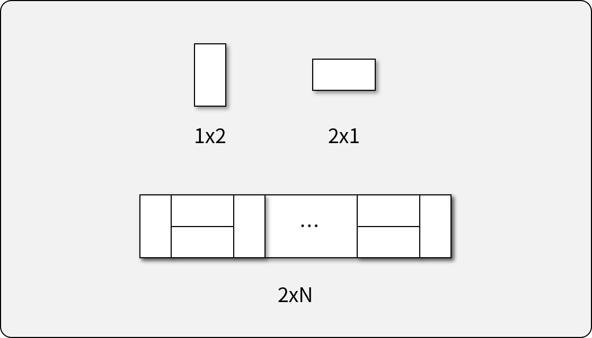
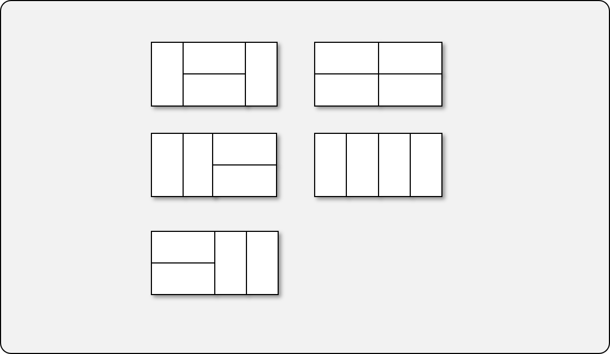

# 직사각형 퍼즐

## 문제 설명



가로 길이가 2이고 세로의 길이가 1인 직사각형모양의 타일이 있습니다. 이 직사각형 타일을 이용하여 세로의 길이가 2이고 가로의 길이가 n인 바닥을 가득 채우려고 합니다. 타일을 채울 때는 다음과 같이 2가지 방법이 있습니다.

- 타일을 가로로 배치 하는 경우
- 타일을 세로로 배치 하는 경우

직사각형의 가로의 길이 n이 매개변수로 주어질 때, 이 직사각형을 채우는 방법의 수를 return 하는 solution 함수를 완성해주세요.

### 제한 사항

- 가로의 길이 n은 60,000이하의 자연수 입니다.
- 경우의 수가 많아 질 수 있으므로, 경우의 수를 1,000,000,007으로 나눈 나머지를 return해주세요.

### 입출력 예

| n | result |
|---|--------|
| 4 |   5    |

### 입출력 예에 대한 설명

다음과 같이 5가지 방법이 있다.


### 참조 코드

- [기반 소스 코드](src/before.py)
- [솔루션 코드](src/after.py)

-----

## 문제 풀이

### 접근 요령

- 작은 문제를 쌓아 올려 문제가 복잡해지는 경우
- 주어진 문제를 역으로 작은 문제로 쪼개는 방법을 찾는다.
  - 점화식으로 표현하여 큰 문제를 작은 문제로 치환
- 재귀 함수 vs. 동적 계획법
  - 재귀 함수: 재귀 함수의 깊이(함수가 호출되는 횟수)가 작을 경우 사용 가능 (Top-Down)
  - 동적 계획법: 연쇄적으로 풀어야 하는 작은 문제의 횟수에 제한이 없으나, 메모리를 많이 소비 (Bottom-Up)

### 동적 계획법 (Dynamic Programming; DP)


- 큰 문제를 작은 문제로 쪼개어 해결하는 분할 정복 (Divide & Conquer) 방법 중 하나
  - 작은 문제로 쪼갰을 때, 중복되는 문제가 많이 발생하면 DP를 사용한다.
- 중복되는 연산을 미리 캐싱해 두고, 중복 연산이 발생할 때 마다 참조하여 연산을 줄인다. (Memoization)
  - Array를 이용하여 저장할 수도 있고, **Hash Table**을 이용할 수도 있다.
  - Hash Table이 참조 속도가 빨라, 이를 이용하는 것이 유리하다.

### 동적 계획법의 예

피보나치 수열 (`f(n) = f(n-1) + f(n-2), f(1) = 0, f(2) = 1`)

```python
fibo = dict()
fibo[1] = 0
fibo[2] = 1

for i in range(1, 1001):
    if i in fibo:
        continue
    fibo[i] = fibo[i - 1] + fibo[i - 2]

print(fibo[1000])
```

## 문제 출처

<https://programmers.co.kr/learn/courses/30/lessons/12900>
